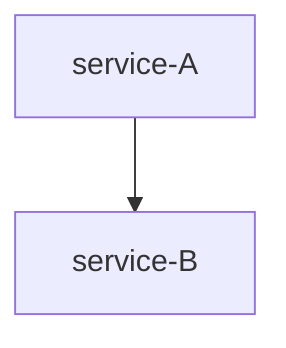

# Visualizer

A Python-based tool for transforming trace/span records into hierarchical tree structures and Mermaid.js flowcharts.

---

## Features
- Load records from a JSON file.
- Convert raw dictionaries into `Record` objects.
- Build a hierarchical `Tree` of spans using parent-child relationships.
- Generate a Mermaid flowchart (`flowchart TD`) representation for visualization.
- Print tree structure in plain text.

---

## Installation

```bash
# Clone this repository
git clone https://github.com/yourusername/visualizer.git
cd visualizer

# Install dependencies
pip install -r requirements.txt
```

### Dependencies
- `mermaid-builder`
- `mermaid`
- Python 3.8+

---

## Usage

### Input JSON Format
Your JSON file should contain a list of records under the key `records`:

```json
{
  "records": [
    {
      "dt.entity.service.entity.name": "service-A",
      "trace.id": "t1",
      "span.id": "s1",
      "span.parent_id": null,
      "duration": 120,
      "start_time": "2023-01-01T00:00:00Z",
      "end_time": "2023-01-01T00:00:02Z"
    },
    {
      "dt.entity.service.entity.name": "service-B",
      "trace.id": "t1",
      "span.id": "s2",
      "span.parent_id": "s1",
      "duration": 60,
      "start_time": "2023-01-01T00:00:01Z",
      "end_time": "2023-01-01T00:00:02Z"
    }
  ]
}
```

### Run
```bash
python visualizer.py input.json
```

### Output
1. Prints number of records loaded.
2. Prints parent-child relationships during flowchart generation.
3. Outputs a Mermaid flowchart string:

```
flowchart TD
    id0[service-A]
    id1[service-B]
    id0 --> id1
```

This string can be used in Markdown or Mermaid-compatible viewers.

---

## Example: Visualizing with Mermaid
Download a JSON representation of your business transactions

```
{
    "records": [
        {
            "dt.entity.service.entity.name": "auth-service",
            "trace.id": "t1",
            "span.id": "s1",
            "span.parent_id": null,
            "duration": 133,
            "start_time": "2023-01-01T00:00:05Z",
            "end_time": "2023-01-01T00:00:05.133000Z"
        },
        {
            "dt.entity.service.entity.name": "service-A",
            "trace.id": "t1",
            "span.id": "s2",
            "span.parent_id": "s1",
            "duration": 68,
            "start_time": "2023-01-01T00:00:05.076000Z",
            "end_time": "2023-01-01T00:00:05.144000Z"
        },
        {
            "dt.entity.service.entity.name": "service-B",
            "trace.id": "t1",
            "span.id": "s3",
            "span.parent_id": "s2",
            "duration": 169,
            "start_time": "2023-01-01T00:00:05.105000Z",
            "end_time": "2023-01-01T00:00:05.274000Z"
        },
        {
            "dt.entity.service.entity.name": "db-service",
            "trace.id": "t2",
            "span.id": "s4",
            "span.parent_id": "s3",
            "duration": 80,
            "start_time": "2023-01-01T00:00:10Z",
            "end_time": "2023-01-01T00:00:10.080000Z"
        },
        {
            "dt.entity.service.entity.name": "service-C",
            "trace.id": "t2",
            "span.id": "s5",
            "span.parent_id": "s4",
            "duration": 125,
            "start_time": "2023-01-01T00:00:10.026000Z",
            "end_time": "2023-01-01T00:00:10.151000Z"
        },
        {
            "dt.entity.service.entity.name": "db-service",
            "trace.id": "t3",
            "span.id": "s6",
            "span.parent_id": "s5",
            "duration": 51,
            "start_time": "2023-01-01T00:00:15Z",
            "end_time": "2023-01-01T00:00:15.051000Z"
        },
        {
            "dt.entity.service.entity.name": "payment-gateway",
            "trace.id": "t3",
            "span.id": "s7",
            "span.parent_id": "s6",
            "duration": 68,
            "start_time": "2023-01-01T00:00:15.022000Z",
            "end_time": "2023-01-01T00:00:15.090000Z"
        },
        {
            "dt.entity.service.entity.name": "auth-service",
            "trace.id": "t3",
            "span.id": "s8",
            "span.parent_id": "s7",
            "duration": 216,
            "start_time": "2023-01-01T00:00:15.047000Z",
            "end_time": "2023-01-01T00:00:15.263000Z"
        },
        {
            "dt.entity.service.entity.name": "payment-gateway",
            "trace.id": "t3",
            "span.id": "s9",
            "span.parent_id": "s8",
            "duration": 245,
            "start_time": "2023-01-01T00:00:15.242000Z",
            "end_time": "2023-01-01T00:00:15.487000Z"
        },
        {
            "dt.entity.service.entity.name": "db-service",
            "trace.id": "t3",
            "span.id": "s10",
            "span.parent_id": "s9",
            "duration": 253,
            "start_time": "2023-01-01T00:00:15.282000Z",
            "end_time": "2023-01-01T00:00:15.535000Z"
        },
        {
            "dt.entity.service.entity.name": "service-C",
            "trace.id": "t4",
            "span.id": "s11",
            "span.parent_id": "s10",
            "duration": 70,
            "start_time": "2023-01-01T00:00:20Z",
            "end_time": "2023-01-01T00:00:20.070000Z"
        },
        {
            "dt.entity.service.entity.name": "db-service",
            "trace.id": "t4",
            "span.id": "s12",
            "span.parent_id": "s11",
            "duration": 212,
            "start_time": "2023-01-01T00:00:20.026000Z",
            "end_time": "2023-01-01T00:00:20.238000Z"
        },
        {
            "dt.entity.service.entity.name": "db-service",
            "trace.id": "t4",
            "span.id": "s13",
            "span.parent_id": "s12",
            "duration": 277,
            "start_time": "2023-01-01T00:00:20.179000Z",
            "end_time": "2023-01-01T00:00:20.456000Z"
        },
        {
            "dt.entity.service.entity.name": "service-A",
            "trace.id": "t4",
            "span.id": "s14",
            "span.parent_id": "s13",
            "duration": 290,
            "start_time": "2023-01-01T00:00:20.417000Z",
            "end_time": "2023-01-01T00:00:20.707000Z"
        },
        {
            "dt.entity.service.entity.name": "auth-service",
            "trace.id": "t4",
            "span.id": "s15",
            "span.parent_id": "s14",
            "duration": 295,
            "start_time": "2023-01-01T00:00:20.659000Z",
            "end_time": "2023-01-01T00:00:20.954000Z"
        },
        {
            "dt.entity.service.entity.name": "service-C",
            "trace.id": "t5",
            "span.id": "s16",
            "span.parent_id": "s15",
            "duration": 64,
            "start_time": "2023-01-01T00:00:25Z",
            "end_time": "2023-01-01T00:00:25.064000Z"
        },
        {
            "dt.entity.service.entity.name": "auth-service",
            "trace.id": "t5",
            "span.id": "s17",
            "span.parent_id": "s16",
            "duration": 124,
            "start_time": "2023-01-01T00:00:25.015000Z",
            "end_time": "2023-01-01T00:00:25.139000Z"
        },
        {
            "dt.entity.service.entity.name": "service-B",
            "trace.id": "t5",
            "span.id": "s18",
            "span.parent_id": "s17",
            "duration": 72,
            "start_time": "2023-01-01T00:00:25.134000Z",
            "end_time": "2023-01-01T00:00:25.206000Z"
        },
        {
            "dt.entity.service.entity.name": "service-A",
            "trace.id": "t5",
            "span.id": "s19",
            "span.parent_id": "s18",
            "duration": 134,
            "start_time": "2023-01-01T00:00:25.189000Z",
            "end_time": "2023-01-01T00:00:25.323000Z"
        },
        {
            "dt.entity.service.entity.name": "auth-service",
            "trace.id": "t5",
            "span.id": "s20",
            "span.parent_id": "s19",
            "duration": 194,
            "start_time": "2023-01-01T00:00:25.296000Z",
            "end_time": "2023-01-01T00:00:25.490000Z"
        }
    ]
}
```

Place the generated Mermaid output inside a Markdown file:

```markdown

```

Render with GitHub, VSCode Mermaid preview, or other Mermaid tools.

---

## Project Structure
```
visualizer.py       # Main script
record.py           # Defines Record class
tree.py             # Defines Tree class
```
