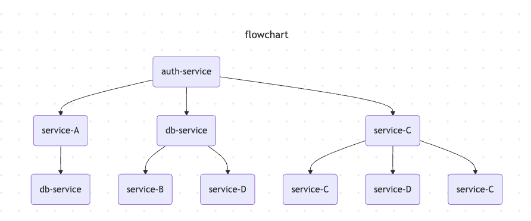

# Visualizer

A Python-based tool for transforming trace/span records into hierarchical tree structures and Mermaid.js flowcharts.

---

## Features
- Load records from a JSON file.
- Convert raw dictionaries into `Record` objects.
- Build a hierarchical `Tree` of spans using parent-child relationships.
- Generate a Mermaid flowchart (`flowchart TD`) representation for visualization.
- Print tree structure in plain text.

---

## Installation

```bash
# Clone this repository
git clone https://github.com/yourusername/visualizer.git
cd visualizer

# Install dependencies
pip install -r requirements.txt
```

### Dependencies
- `mermaid-builder`
- `mermaid`
- Python 3.8+

---

## Usage

### Input JSON Format
Your JSON file should contain a list of records under the key `records`:

```json
{
  "records": [
    {
      "dt.entity.service.entity.name": "service-A",
      "trace.id": "t1",
      "span.id": "s1",
      "span.parent_id": null,
      "duration": 120,
      "start_time": "2023-01-01T00:00:00Z",
      "end_time": "2023-01-01T00:00:02Z"
    },
    {
      "dt.entity.service.entity.name": "service-B",
      "trace.id": "t1",
      "span.id": "s2",
      "span.parent_id": "s1",
      "duration": 60,
      "start_time": "2023-01-01T00:00:01Z",
      "end_time": "2023-01-01T00:00:02Z"
    }
  ]
}
```

### Run
```bash
python visualizer.py input.json
```

### Output
1. Prints number of records loaded.
2. Prints parent-child relationships during flowchart generation.
3. Outputs a Mermaid flowchart string:

```
flowchart TD
    id0[service-A]
    id1[service-B]
    id0 --> id1
```

This string can be used in Markdown or Mermaid-compatible viewers.

---

## Example: Visualizing with Mermaid
Download a JSON representation of your business transactions


```json
{
  "records": [
    {
      "dt.entity.service.entity.name": "auth-service",
      "trace.id": "t1",
      "span.id": "s1",
      "span.parent_id": null,
      "duration": 157,
      "start_time": "2023-01-01T00:00:10Z",
      "end_time": "2023-01-01T00:00:10.157000Z"
    }

  ...

  ]
}
```

Place the generated Mermaid output inside a Markdown file:

```---
title: flowchart
---
flowchart TD
  id0("`auth-service`")
  id1("`service-A`")
  id2("`db-service`")
  id3("`db-service`")
  id4("`service-B`")
  id5("`service-D`")
  id6("`service-C`")
  id7("`service-C`")
  id8("`service-D`")
  id9("`service-C`")
  id0 --> id1
  id1 --> id2
  id0 --> id3
  id3 --> id4
  id3 --> id5
  id0 --> id6
  id6 --> id7
  id6 --> id8
  id6 --> id9

```


Render with GitHub, VSCode Mermaid preview, or other Mermaid tools.



---

## Project Structure
```
visualizer.py       # Main script
record.py           # Defines Record class
tree.py             # Defines Tree class
```
